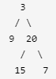

# 重建二叉树

> 输入某二叉树的前序遍历和中序遍历的结果，请重建该二叉树。假设输入的前序遍历和中序遍历的结果中都不含重复的数字。

>示例
>输入：
>前序遍历 preorder = [3,9,20,15,7]
  中序遍历 inorder = [9,3,15,20,7]
  输出：
  
  # 思路
  ## 方法一  
  > 二叉树的前序遍历顺序是：根节点、左子树、右子树，每个子树的遍历顺序同样满足前序遍历顺序。
二叉树的中序遍历顺序是：左子树、根节点、右子树，每个子树的遍历顺序同样满足中序遍历顺序。
前序遍历的第一个节点是根节点，只要找到根节点在中序遍历中的位置，在根节点之前被访问的节点都位于左子树，在根节点之后被访问的节点都位于右子树，由此可知左子树和右子树分别有多少个节点。
由于树中的节点数量与遍历方式无关，通过中序遍历得知左子树和右子树的节点数量之后，可以根据节点数量得到前序遍历中的左子树和右子树的分界，因此可以进一步得到左子树和右子树各自的前序遍历和中序遍历，可以通过递归的方式，重建左子树和右子树，然后重建整个二叉树。
使用一个 字典**dict**存储中序遍历的每个元素及其对应的下标，目的是为了快速获得一个元素在中序遍历中的位置。调用递归方法，对于前序遍历和中序遍历，下标范围都是从 0 到 n-1，其中 n 是二叉树节点个数。
递归方法的基准情形有两个：判断前序遍历的下标范围的开始和结束，若开始大于结束，则当前的二叉树中没有节点，返回空值 null。若开始等于结束，则当前的二叉树中恰好有一个节点，根据节点值创建该节点作为根节点并返回。
若开始小于结束，则当前的二叉树中有多个节点。在中序遍历中得到根节点的位置，从而得到左子树和右子树各自的下标范围和节点数量，知道节点数量后，在前序遍历中即可得到左子树和右子树各自的下标范围，然后递归重建左子树和右子树，并将左右子树的根节点分别作为当前根节点的左右子节点。

 - 时间复杂度:O(n)
 - 空间复杂度:O(n)

# 代码

``` python
class Solution:
    
    def buildTree(self, preorder: List[int], inorder: List[int]) -> TreeNode:
        if not preorder:
            return None
        dic = {}
        for i in range(len(inorder)):
            dic[inorder[i]] = i
        root = TreeNode(preorder[0])
        num = dic[root.val]  # 获取中序分割下标
        in_left = inorder[:num]
        in_right = inorder[num + 1:]
        in_left_len = len(in_left)
        pre_left = preorder[1:in_left_len+1]
        pre_right = preorder[in_left_len + 1:]
        root.left = self.buildTree(pre_left, in_left)
        root.right = self.buildTree(pre_right, in_right)
        return root
```

